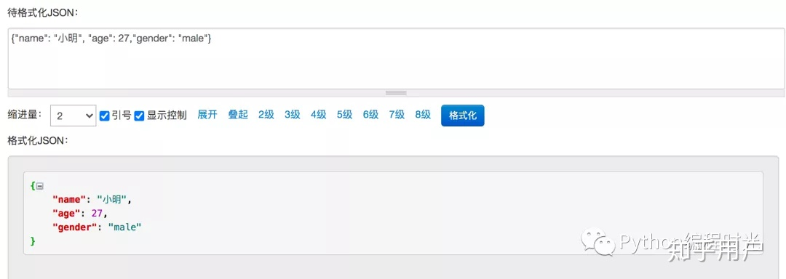

## pycharm插件

***
#### 一、Rainbow Brackets
> 可以让代码块之间清晰的显示各种颜色，支持多种编程语言

#### 二、Json Parse in PyCharm
> 在开发过程中，经常会把校验一串 JSON 字符串是否合法，在以前我的做法都是打开 https://tool.lu/json/ 这个在线网站，直接美化来校验，只有 JSON 格式都正确无误合法的，才能够美化。

#### 三、 Material Theme UI
> Material Theme UI 是JetBrains IDE（IntelliJ IDEA，WebStorm，
> Android Studio等）的插件，可将原始外观更改为Material Design外观

#### 四、 Statistic 
>statistic是一个项目统计插件，简单来说就是可以给出一个项目的统计信息，
> 包括文件和代码量等，在Pycharm的左下角增加一个Statistic选项，点击
> 这个按钮就可以查看项目的统计信息了。

#### 五、CodeGlance
> 将类似于Sublime中的代码小地图嵌入到编辑器窗格中。使用自定义颜色进行
> 语法高亮，同时使用明暗主题。

#### 六、 ideaVim
> 