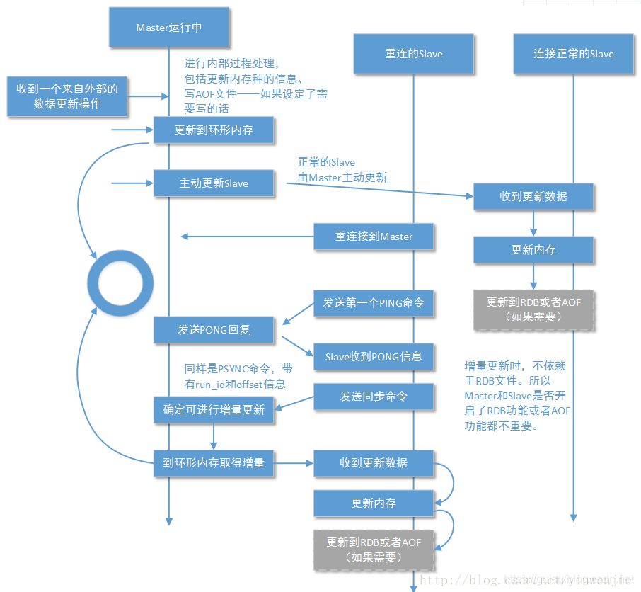

# redis原理解析

### 一、基本数据结构

    1 简单动态字符串（SDS：simple dynamic string）
    2 链表
    3 字典
    4 跳跃表
    5 整数集合
    6 压缩列表
    7 对象（5种数据结构、内存回收、对象共享）

### 二、单机数据库

    1 数据库
    2 RDB 持久化
    3 AOF 持久化
    4 事件
    5 客户端
    6 服务器

### 三、多机数据库

    1 复制（主从复制）
    2 哨兵（sentinel）
    3 集群（cluster）

### 四、独立功能

    1 订阅和发布功能
    2 事物操作
    3 lua脚本支持
    4 排序
    5 二进制位数组
    6 慢查询日志
    7 监视器

***

### 锁

    - 被关锁
    - 乐观锁

### 基本数据结构

1. 简单动态字符串对象
   - 

2. 链表

### 主从复制

1. 过程：客户端发送slaveof 服务端ip 端口号，此redis服务端将成为目标服务器的从服务器，主服务器通过BGSAVE生成RDB快照，从从服务器
   执行RDB更新数据库，在此期间主服务器记录写命令，然后将写命令同步到从服务器，使主从数据库一直
2. 完全重同步和部分重同步
    - 主从复制第一次的时候需要完全重同步来保证数据库的一致性，当有从服务器宕机重联后，主服务器的数据和从服务器数据不一致了，此时就需要 部分重同步，部分重同步的三个概念：
        - 复制偏移量
        - 积压缓存区
        - 服务器ID
    - 复制偏移量
        - 主从之间通过ping/pang命令保持连接，主从服务器都保存一个复制偏移量，同时从服务器保存主服务器的Id，当从服务器宕机重联后，从服务器
          将复制偏移量和服务器id发给主服务器，只服务器通过从服务器发送的id校验宕机之前是否连接的是自己，如果不是自己，那直接执行完全重同步，
          如果是自己，通过对比复制偏移量，去积压缓存区中找出需要补增的数据，发给从服务器，进而实现主从数据库一致性。如果复制偏移量已经不在积 压缓存区，则执行完全重同步。
    - 积压缓存区
        - 挤压缓存区是一个队列，遵循先进先出，所有写命令被一次添加在队列中，并按照复制偏移量进行编号，默认情况下复制偏移量大小为1M，此大小可以 根据具体写业务的频繁成都进行调整。
    - 服务器ID
        - 用于记录主服务的id，在宕机重联后进行校验

3. 基本语法
   ```shell
   # 实现主从复制
      slaveof 主服务地址 端口号
   # 查看对应客户端状态
      info replication
   ```

4. 心跳检测
    - 检测主从服务器联网状态
    - 辅助实现min-slaves配置选项
        - min-slaves-to-write num 从服务器数量
        - min-slaves-max-lag second 从服务器延迟值
        - 从服务器少于num个，或num个从服务器延迟大于second秒时，主服务器拒绝写命令
    - 命令检测丢失



***

<<<<<<< HEAD
#### 哨兵/哨岗（sentinel）
=======
1. 主从复制
   - psync、sync
>>>>>>> 8a31b0fecf94af87d5308e0147418685281865a4

***

### 发布和订阅

1. 基本命令
    - PUBLIST 想频道推送消息
    - SUBSCRIBE/UNSUBCRIBE 订阅/退订频道
    - PSUBSCRIBE/PUNSUBCRIBE 订阅/退订模式
    - PUBSUB CHANNELS 查看频道
    - PUBSUB NUMPAT 查看订阅的模式数量
   ```shell
   # 向某个频道推送消息：publist 频道 消息
      publish new-it success
   # 订阅/退订频道： subscribe 频道名称(一个或多个)  包含该频道就将订阅者加入到该频道链表的最后，不包含该频道，则创建
      subscribe new-it new-sport
      unsubscribe new-it new-sport
   # 订阅/退订模式：psubscribe 模式名称
      psubscribe new-it new-sport
      punsubscribe new-it new-sport
   # 查看频道信息
      subpub channels
   # 查看模式数量
      subpub numpat 
   ```

2. 发布订阅分为频道和模式，客户端可以订阅和去掉订阅某一个频道，也可以订阅和取消订阅某一个模式，模式是一些频道的集合。
   加入用户订阅的某个频道，当该频道有消息进来时，客户端就能收到此消息，订阅了相关模式也同理。频道和模式都存储在redisServer
   字典中，pubsub_channel属性存储频道相关，pubsub_patterns属性存储模式相关。频道中键是频道的名称，值是一个链表； 模式是一个链表，每个节点是一个pubsubPattern（{"client":...,"
   pattern":...}）

***

### 事务

1. 四大原则
    - 原子性（atomic）要么执行所有的操作，要么就一个操作也不执行
    - 一致性（consistency）数据库在执行事物之前是一致的，在执行事物之后也是一致的
    - 隔离性（Isolation）不同事务之间不会产生相互影响
    - 持久性（durability） 在RDB或AOF模式下才具有此特性

2. 基础命令
    - MULIT、EXEC、WATCH（监视某个健）

***

### 二进制位数组

1. 基础命令
    - SETBIT
    - GETBIT
    - BITCOUNT时间复杂度 O(n)
    - BITOP（逻辑或｜、逻辑与&、逻辑非~、逻辑异或^）
   ```shell
   # 
   ```

2. BITCOUNT的三种实现
    - 遍历
    - 查表法
    - swar方法（计算汉明重量）
    - redis中采用第二种和第三种组合的方式来实现
3. redis使用SDS保存位数组，并按照逆序的形式存储，这样主要是为了易于空间扩展

***

### 监视器

1. monitor让一个客户端成为监视器 实时的接收并打印服务器处理的命令请求
   ```shell
    MONITOR
   ```

***

### 满查询日志

1. 参数
    - slow-log-slower-than 数值 执行时间超过多少秒的记录到慢查询日志
    - slowlog-max-len 数值服务器最多保存多少调慢查询日志

### redis实现分布式锁

1.

```shell
# 使用setnx，存在则不做任何处理，不存在则设置
>>setnx key value # 不存在则创建，返回True
>>"1"
>>setnx key value # 存在，不做任何处理，返回False
>>"0"
```

2. 高并发下需要考虑的问题
   - 程序执行过程中报错
   - 宕机
   - 锁过期
   - 锁续命（创建一个子进程，每隔一段时间获取key然后设置过期时间）