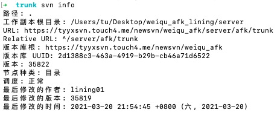

# SVN

1 检出项目

```shell
svn checkout URL
# example
svn checkout https://https://tyyxsvn.touch4.me/newsvn/weiqu_afk/server/afk/trunk
```

2 更新项目

```shell
svn up/update
```

3 提交更改

```shell
svn ci -m "描述信息"
```

4 查看修改状态

```shell
svn st/status
```

5 查看版本信息

```shell
svn info
```

> 

6 回滚到版本库代码

```shell
# 将当前文件夹下所有代码回滚
svn revert -R ./
#将当前文件回滚
svn revert 文件
```

7 创建分支

```shell
svn cp 需要clone的代码路径 clone后代码路径 -m "描述信息"
# 示例
svn cp https://tyyxsvn.touch4.me/newsvn/weiqu_afk/server/afk/trunk https://tyyxsvn.touch4.me/newsvn/weiqu_afk/server/afk/branches/lining_gm -m ""
```

8 删除分支

```shell
# 第一步，先删除
svn rm 分支名 # 删除分支，如果本地有修改，则报错
svn rm 分支名 --force #强制删除分支，在本地有修改的情况下使用
# 第二步，提交版本库
svn ci 分支名 -m ""
```

9 合并分支

```shell
# 第一步：合并之前应该先将代码更新至最新版本
svn up
# 第二步：合并代码
svn merge url(需要合并的代码路径)
# 示例
svn merge ../../trunk # 将主干代码合并到分支
svn merge ../branches/lining_gm #将分支代码合并到主干
```